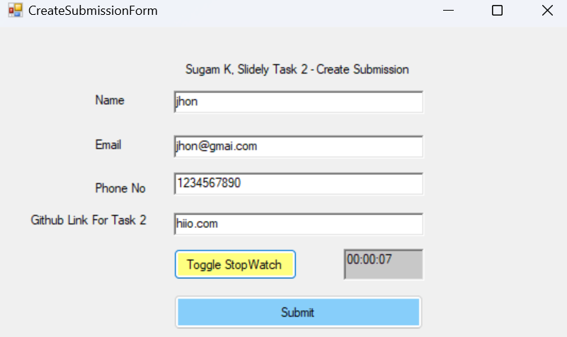

Frontend

```markdown
# FormClone

## Table of Contents
- [Description](#description)
- [Features](#features)
- [Installation](#installation)
- [Usage](#usage)
  - [Creating a New Submission](#creating-a-new-submission)
  - [Viewing Submissions](#viewing-submissions)
  - [Keyboard Shortcuts](#keyboard-shortcuts)
- [Validation](#validation)
- [API Endpoints](#api-endpoints)
- [Additional Features](#additional-features)
- [Screenshots](#screenshots)
- [Contributing](#contributing)
- [License](#license)

## Description
FormClone is a Windows desktop application developed using Visual Basic in Visual Studio. It allows users to create and view submissions with ease. The application features a simple form for creating new submissions and another form for viewing existing submissions. Additionally, it supports keyboard shortcuts for various actions to enhance user experience.

## Features
### Create New Submission
- Fields for Name, Email, Phone Number, and GitHub Repository Link.
- Stopwatch functionality that pauses and resumes without resetting.
- Validation for form fields to ensure correct input.
- Submit button to send data to the backend.

### View Submissions
- Navigation through submissions using "Previous" and "Next" buttons.
- Displays submission details including Name, Email, Phone Number, GitHub Repository Link, and Stopwatch Time.

### Keyboard Shortcuts
- `Ctrl + V`: Open View Submissions form.
- `Ctrl + N`: Open Create New Submission form.
- `Ctrl + S`: Submit the form on Create New Submission page.
- `Ctrl + T`: Pause/Resume the stopwatch.

### Form Field Validation
- **Name**: Should contain only letters.
- **Email**: Must be a valid email address format.
- **Phone**: Must be a 10-digit number.
- **All Fields**: Must be filled out before submission.

### Additional Features
- Option to delete submitted forms.
- Option to edit submitted forms.
- User-friendly interface with intuitive navigation.

## Installation
1. Clone the Repository
   ```bash
   git clone https://github.com/yourusername/FormClone.git
   ```
2. Open the Project
   - Open Visual Studio.
   - Select `File > Open > Project/Solution`.
   - Navigate to the cloned repository and open the solution file (`FormClone.sln`).
3. Build the Project
   - In Visual Studio, select `Build > Build Solution` to compile the project.
4. Run the Application
   - Press `F5` to run the application.

## Usage
### Creating a New Submission
1. Click on the "Create New Submission" button or press `Ctrl + N`.
2. Fill in the form fields (Name, Email, Phone Number, GitHub Repository Link).
3. Use the stopwatch button to pause/resume the timer.
4. Click "Submit" or press `Ctrl + S` to submit the form.

### Viewing Submissions
1. Click on the "View Submissions" button or press `Ctrl + V`.
2. Use the "Previous" and "Next" buttons to navigate through the submissions.
3. View the submission details displayed on the form.

### Keyboard Shortcuts
- `Ctrl + V`: Open View Submissions form.
- `Ctrl + N`: Open Create New Submission form.
- `Ctrl + S`: Submit the form on Create New Submission page.
- `Ctrl + T`: Pause/Resume the stopwatch.

## Validation
- **Name**: Only letters are allowed.
- **Email**: Must follow a valid email format (e.g., example@example.com).
- **Phone Number**: Must be a 10-digit number.
- **All Fields**: Must be filled out before submission.

## API Endpoints
The application interacts with a backend server to fetch and update submission data.
- **GET /read**: Fetches submission data.
- **POST /submit**: Creates a new submission.
- **PUT /edit**: Updates an existing submission.
- **DELETE /delete**: Deletes a submission.

## Additional Features
- **Edit Submission**: Toggle read-only mode for text boxes to edit submission details.
- **Delete Submission**: Delete an existing submission.

### Main Form


### Create Submission Form


### View Submission Form

## Contributing
Contributions are welcome! Please follow these steps to contribute:
1. Fork the repository.
2. Create a new branch (`git checkout -b feature-branch`).
3. Make your changes.
4. Commit your changes (`git commit -m 'Add new feature'`).
5. Push to the branch (`git push origin feature-branch`).
6. Open a Pull Request.

## License
This project is licensed under the MIT License. See the [LICENSE](LICENSE) file for details.
```
